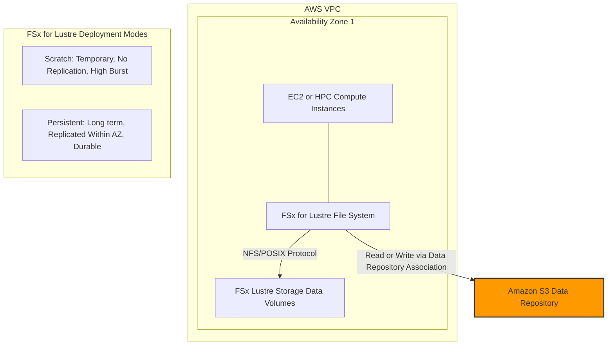

## 💾 Amazon FSx: The Managed File System Toolkit

Amazon FSx is a family of fully managed services that allows you to launch and run **third-party high-performance file systems** on AWS, much like RDS does for relational databases.

It abstract away the complexity of managing file servers, storage, and software configuration for specialized workloads.

-----

## 🔑 The Four FSx File Systems

| File System | Primary Protocol(s) | Key Feature / Use Case |
| :--- | :--- | :--- |
| **FSx for Windows File Server** | **SMB** (Server Message Block), NTFS | Fully managed **Windows shared drive**. Ideal for enterprise apps, home directories, and lift-and-shift of Windows workloads. |
| **FSx for Lustre** | **POSIX-compliant** (Linux & Cluster derived) | High-Performance Computing (**HPC**), Machine Learning (ML), video processing, and **S3 data lakes**. |
| **FSx for NetApp ONTAP** | **NFS**, **SMB**, **iSCSI** | Managed **NetApp ONTAP NAS** system. Broad compatibility, data compression/deduplication, and instantaneous cloning. |
| **FSx for OpenZFS** | **NFS** (Network File System) | Managed **OpenZFS** file system. High performance (up to 1M IOPS, \<0.5ms latency), compression, and instantaneous cloning. |

-----

## 🖥️ FSx for Windows File Server Deep Dive

  * **Protocol & Compatibility:** Uses the native **SMB** protocol and **NTFS** file system.
  * **Security:** Integrates seamlessly with **Microsoft Active Directory** for security, and supports ACLs and user quotas.
  * **Cross-Platform Access:** A crucial exam point: it can be mounted on **Linux EC2 instances** as well as Windows.
  * **Hybrid Connectivity:** Supports **Multi-AZ** for high availability and **DFS (Distributed File System)** to group with on-premises Windows File Servers.
  * **Storage Options:**
      * **SSD:** Low-latency sensitive workloads (databases, media processing).
      * **HDD:** Cost-effective, throughput-focused (home directories, CMS).
  * **Data Protection:** Backed up daily to **Amazon S3** for disaster recovery.

-----

## 🔬 FSx for Lustre Deep Dive (HPC Focus)

**Lustre** is a highly distributed parallel file system (derived from **L**inux + cl**uster**), optimized for speed.

  * **Primary Use Case:** **High-Performance Computing (HPC)**, Machine Learning (ML), financial modeling, and electronic design automation.
  * **Performance:** Massive scale: hundreds of GB/s, millions of IOPS, sub-millisecond latency.
  * **S3 Integration (Key Feature):** It can use an S3 bucket as its **data repository**.
      * You can read your S3 data lake *as a file system* through FSx for Lustre.
      * You can write the output of your high-speed computations back to S3.
  * **Storage Options:**
      * **SSD:** Low-latency, IOPS-intensive, random file operations.
      * **HDD:** Throughput-intensive, large and sequential file operations (cheaper).

### 🚀 Deployment Options (Critical for Exam)

| Deployment Type | Use Case | Durability / Replication | Performance |
| :--- | :--- | :--- | :--- |
| **Scratch** | **Short-term processing**, temporary storage, cost optimization. | **No replication** (Data is lost if server fails). | Highest burst performance (6x persistent), high throughput per TiB. |
| **Persistent** | **Long-term storage**, sensitive data, stable processing. | **Replicated** within the **same AZ**. Files are replaced transparently on server failure. | Consistent, lower baseline performance than Scratch burst mode. |

> ℹ️ **Missing Concept Note:** The transcription mentions FSx for Lustre only living in one AZ for the diagram, but it's important to know that **Persistent 2** is the latest generation and supports replication within the AZ for durability. FSx for Lustre is generally deployed within a **Single-AZ**.

-----

## ☁️ FSx for NetApp ONTAP & OpenZFS

These services simplify migrating on-premises NAS/ZFS workloads to AWS while retaining native features.

### FSx for NetApp ONTAP

  * **Protocol Compatibility:** The most versatile: **NFS, SMB, and iSCSI**.
  * **Key Features (NetApp Workload Migration):**
      * **Automatic scaling** (shrink/grow).
      * **Low cost** via data **compression** and data **de-duplication** (finding and removing duplicate file blocks).
      * **Point-in-Time Instantaneous Cloning** (helpful for testing/staging).
      * Broad client compatibility (Linux, Windows, macOS, EC2, EKS, VMware Cloud).

### FSx for OpenZFS

  * **Protocol Compatibility:** Primarily **NFS** only.
  * **Key Features (ZFS Workload Migration):**
      * Extremely high performance: up to **1 million IOPS**, sub-**0.5 millisecond latency**.
      * Supports compression and snapshots.
      * **Point-in-Time Instantaneous Cloning**.
      * *Note: The transcript correctly states it does **not** support data deduplication, which is a major differentiator from ONTAP.*

-----

## 📈 Summary Diagram: FSx for Lustre Architecture

