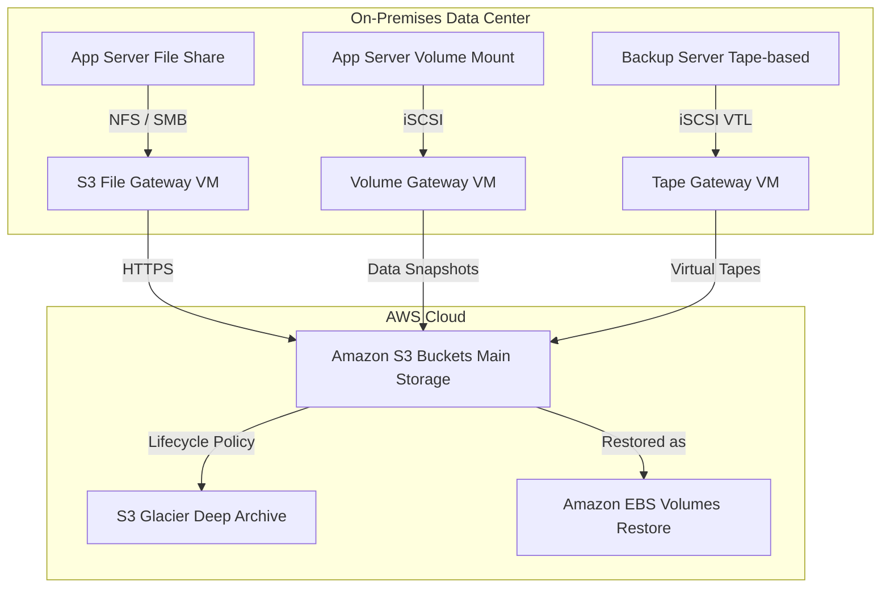

## 🌉 AWS Storage Gateway: Bridging On-Premises to the Cloud

AWS Storage Gateway is a **hybrid cloud storage service** that connects your on-premises applications to cloud storage in AWS. It acts as a **bridge**, allowing you to seamlessly integrate your local infrastructure with scalable, cost-effective AWS storage services like S3 and Glacier.

-----

## 🎯 Use Cases for Storage Gateway

Storage Gateway primarily addresses scenarios where a full cloud migration is not feasible or desired, enabling a **hybrid cloud strategy**.

  * **Disaster Recovery (DR) & Backup:** Back up on-premises data directly to the AWS Cloud for durability.
  * **Storage Extension:** Extend local storage to the cloud for colder, less frequently used data, reducing on-premises storage costs.
  * **Cloud Migration:** Facilitate data migration by first moving backups to the cloud.
  * **Low-Latency Cache:** Use AWS as the primary storage while keeping a local, low-latency cache for the most recent data on-premises.

-----

## 📦 The Three Storage Gateway Types

The service offers three distinct gateway types, each catering to a different on-premises storage need (**File**, **Block**, or **Tape**). The gateway is deployed as a **VM** (Virtual Machine) on your on-premises corporate data center.

### 1\. 📂 Amazon S3 File Gateway (File Storage)

The S3 File Gateway exposes **Amazon S3 objects** as a standard file share to your on-premises application servers.

| Feature | Description |
| :--- | :--- |
| **On-Premises Protocol** | **NFS** (Network File System) and **SMB** (Server Message Block). |
| **Cloud Target** | **Amazon S3 Buckets** (Standard, IA, One Zone-IA, Intelligent-Tiering). |
| **How it Works** | Translates NFS/SMB requests into **HTTPS** requests for S3. |
| **Local Optimization** | Maintains a **cache** on-premises for **most recently used data** to ensure low-latency file access. |
| **Archival Strategy** | Use an **S3 Lifecycle Policy** to transition data from S3 to **S3 Glacier** for cost savings. |
| **Security** | Supports **Active Directory integration** for user authentication when using the SMB protocol. |

### 2\. 🗄️ Volume Gateway (Block Storage)

The Volume Gateway provides **block storage** volumes using the **iSCSI** protocol, which are backed by S3. Its main goal is to enable point-in-time recovery and cloud-based restoration.

| Type | Data Location | Backup Mechanism | Primary Use Case |
| :--- | :--- | :--- | :--- |
| **Cached Volumes** | The **entire dataset is on S3**. The gateway maintains a local **cache** of the most recently accessed data. | Data is stored in S3 and volumes are backed by **EBS Snapshots**. | Low-latency access to frequently used data while saving cost on-premises. |
| **Stored Volumes** | The **entire dataset is stored on-premises**. | Schedules backups of the entire volume to **S3** as **EBS Snapshots**. | Backup and disaster recovery where you need the primary data copy on-premises. |

### 3\. 📼 Tape Gateway (Archival Storage)

The Tape Gateway is designed to replace physical tape infrastructure with cloud-based virtual tapes, allowing companies to retain their existing tape-based backup processes and software.

  * **Interface:** Presents a **Virtual Tape Library (VTL)** using the **iSCSI** protocol.
  * **Cloud Target:** Virtual tapes are stored in **Amazon S3** and can be automatically transitioned to **S3 Glacier** and **S3 Glacier Deep Archive** for long-term, low-cost archival.
  * **Compatibility:** Works with leading third-party backup software vendors.

-----

## 🏗️ Conceptual Architecture Flow

This diagram illustrates how the three gateways sit between your local infrastructure and AWS Cloud storage.

-----

## ➕ Missing Concept: Gateway Deployment Environment

The transcript mentions that the gateway needs to be installed as a **VM** on the corporate data center, and sometimes the customer may not have virtual servers available.

While not explicitly stated in the provided text, AWS offers a solution for this:

  * **AWS Storage Gateway Hardware Appliance:** For customers without an existing virtual environment, AWS offers a pre-validated, physical **hardware appliance** that can be installed on-premises to run the Storage Gateway software.