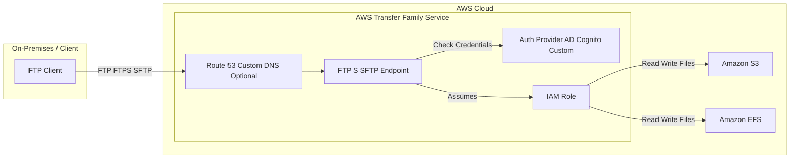

## 📤 AWS Transfer Family: FTP Access to AWS Storage

The **AWS Transfer Family** is a fully managed service that enables the transfer of files into and out of **Amazon S3** or **Amazon EFS** using industry-standard file transfer protocols. It is the essential solution when your clients, partners, or internal systems require file access but cannot use the native S3 API or EFS Network File System (NFS) protocol.

-----

## 🔒 Supported Protocols

AWS Transfer Family abstracts the underlying storage, allowing users to interact with it using familiar FTP protocols.

| Protocol | Full Name | Security | Storage Target |
| :--- | :--- | :--- | :--- |
| **FTP** | File Transfer Protocol | **Unencrypted** (Data is vulnerable in transit) | S3 or EFS |
| **FTPS** | File Transfer Protocol over SSL/TLS | **Encrypted** (Recommended over plain FTP) | S3 or EFS |
| **SFTP** | Secure File Transfer Protocol (SSH-based) | **Encrypted** (Highly common and secure) | S3 or EFS |

> 🔑 **Key Concept:** Always choose **FTPS** or **SFTP** for production workloads to ensure data is **encrypted in flight**.

-----

## ⚙️ Service Features and Architecture

AWS Transfer Family is designed for enterprise-level file transfer needs, offering high availability, scalability, and integration with existing authentication systems.

### 1\. Fully Managed & Scalable

  * The underlying infrastructure (servers, network, storage integration) is **fully managed** by AWS.
  * The service is **highly available** and scales automatically to handle file transfers of any volume.

### 2\. Integration with AWS Storage

  * **Target Storage:** Files are stored directly in **Amazon S3** (Object Storage) or **Amazon EFS** (File System).
  * **Access Mechanism:** AWS Transfer Family uses a dedicated **IAM Role** to transparently read from and write to the designated S3 bucket or EFS file system on behalf of the authenticated user.

### 3\. Authentication Flexibility

Transfer Family provides several options for managing user credentials and access control:

  * **Internal Storage:** Manage user credentials directly within the Transfer Family service.
  * **External Integration (Crucial):** Integrate with existing enterprise directories and identity providers:
      * **Microsoft Active Directory**
      * **LDAP**
      * **Okta**
      * **Amazon Cognito**
      * Any custom identity provider.

### 4\. Networking & Endpoints

  * Users connect via a provisioned **endpoint**.
  * You can optionally use **Amazon Route 53** to provide a custom, user-friendly host name (DNS name) for the FTP/SFTP service instead of the AWS-provided endpoint URL.

### 5\. Pricing

  * You pay per **provisioned endpoint per hour**.
  * You pay a fee per **gigabyte of data transferred** in and out of the service.

-----

## 📝 Conceptual Data Flow

This diagram illustrates the user access and internal communication flow within AWS Transfer Family.

-----

## 💡 Missing Concept: Transfer Family Logging

For operational visibility and compliance, a key feature that is implicitly used but not mentioned is logging:

  * **Logging and Monitoring:** AWS Transfer Family integrates with **Amazon CloudWatch** and **AWS CloudTrail**. CloudWatch provides metrics and logs for operational monitoring, while CloudTrail logs all API calls made to the service for security auditing and compliance.