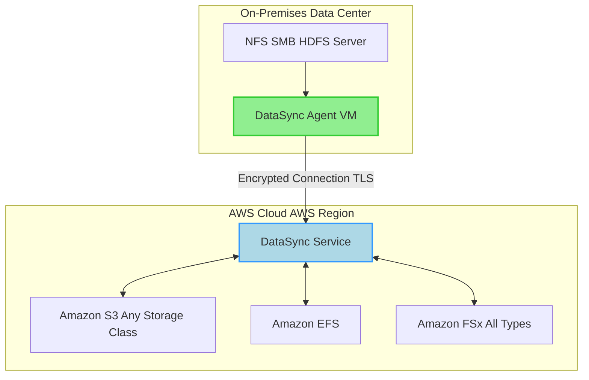

## 🔄 AWS DataSync: High-Speed Data Migration and Synchronization

**AWS DataSync** is a dedicated online data transfer service designed to **simplify, automate, and accelerate** moving large amounts of data to, from, and between various storage locations, including on-premises and AWS. It's an **accelerated, high-performance** solution for bulk data movement and periodic synchronization.

-----

## 🗺️ DataSync Locations and Architecture

DataSync works by defining a **Source Location** and a **Destination Location** and creating a **Task** to move data between them.

| Scenario | Source/Destination Protocols/Services | Agent Requirement |
| :--- | :--- | :--- |
| **On-Premises $\leftrightarrow$ AWS** | **NFS**, **SMB**, **HDFS**, Self-Managed Object Storage $\leftrightarrow$ S3, EFS, FSx | **Required** (VM deployed on-premises) |
| **Cloud $\leftrightarrow$ Cloud** | S3, EFS, FSx $\leftrightarrow$ S3, EFS, FSx (within or across accounts/Regions) | **Not Required** (Fully managed by DataSync service) |
| **Edge Location** | AWS **Snowcone** (agent pre-installed) $\leftrightarrow$ S3, EFS, FSx | **Required** (Pre-installed on Snowcone) |

### On-Premises Architecture Flow

When transferring data to or from your on-premises storage, an **AWS DataSync Agent** is mandatory.

-----

## ✅ Core Capabilities & Key Features

DataSync is often the recommended tool for moving large, active file or object data sets.

  * **Synchronization Direction:** DataSync supports **bi-directional synchronization** (two-way) between locations, not just one-time migrations.
  * **Scheduled Tasks:** Transfers are **not continuous** (not real-time replication). They are **scheduled** to run hourly, daily, or weekly, allowing for incremental updates after the initial copy.
  * **Metadata Preservation (Crucial for Exams\!):** DataSync is designed to **preserve file permissions and metadata**, including **NFS POSIX** and **SMB permissions**, which is a key differentiator from simpler copy methods.
  * **Performance:** A single task can achieve speeds up to **10 Gbps**. You can configure a **bandwidth limit** to avoid maxing out your on-premises network link.
  * **Snowcone Integration:** DataSync is pre-installed on the **AWS Snowcone** device, offering an accelerated transfer solution for disconnected or bandwidth-constrained environments.

-----

## 💡 Missing Concept: Advanced Task Control

The transcript briefly mentions scheduling and bandwidth limits, but DataSync offers more granular control over its transfer tasks:

  * **Task Filters:** You can specify **Include** and **Exclude** filters to control which files or objects are transferred (e.g., only files with a certain extension or name prefix).
  * **Manifest Files (Advanced):** DataSync supports using a **Manifest File** (a defined list of files/objects) to ensure only a specific subset of data is transferred, offering highly precise control over large-scale transfers.
  * **In-flight Validation:** DataSync includes **end-to-end data integrity validation** using checksums to ensure data written to the destination exactly matches the source.